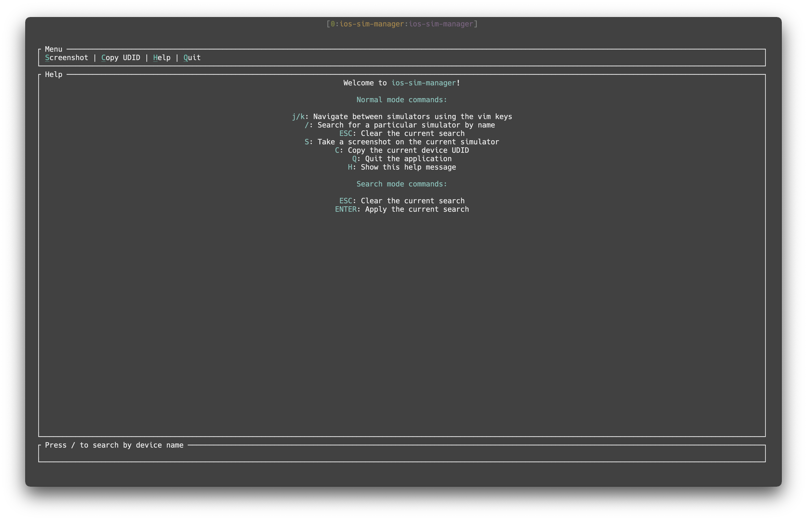

# ios-sim-manager

An iOS Simulator Manager for the Terminal, built in Rust using [the simctl wrapper for Rust](https://github.com/polyhorn/simctl) and [tui-rs](https://github.com/fdehau/tui-rs).

Normal | Search | Help
--- | --- | ---
 |  | 
